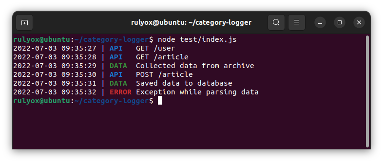

# Category Logger

Log with color-coded categories.

## Example



Create log categories using `Enum` and set colors to each category using `Map`.

```javascript
import CategoryLogger from 'category-logger';

export enum Categories {
    API,
    DATA,
    ERROR,
}

const categoryColors = new Map([
    [Categories.API, '#1976D2'], // blue
    [Categories.DATA, '#388E3C'], // green
    [Categories.ERROR, '#D32F2F'], // red
]);

const logger = new CategoryLogger(Categories, categoryColors, true);
export default logger;
```

```javascript
import logger, { Categories } from './logger';

logger.log(Categories.API, 'GET /user');
logger.log(Categories.API, 'GET /article');
logger.log(Categories.DATA, 'Collected data from archive');
logger.log(Categories.API, 'POST /article');
logger.log(Categories.DATA, 'Saved data to database');
logger.log(Categories.ERROR, 'Exception while parsing data');
```
